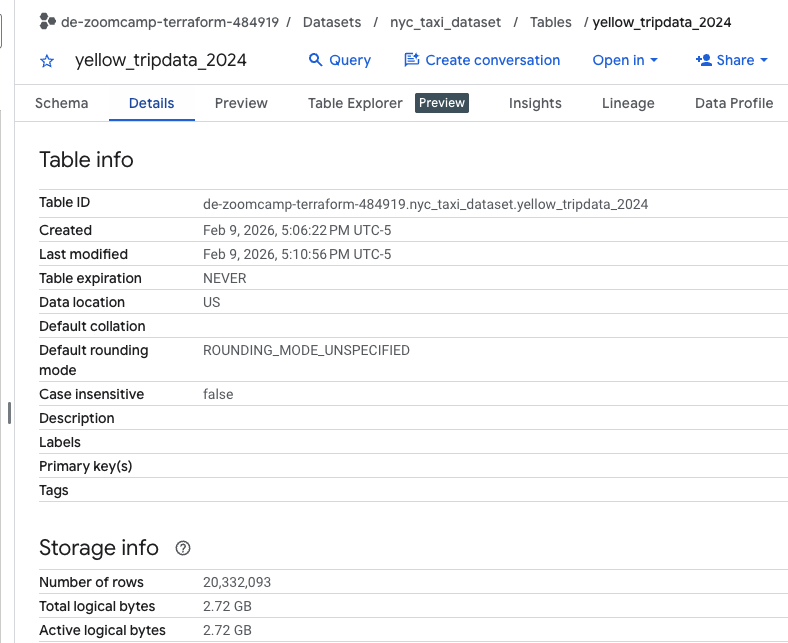
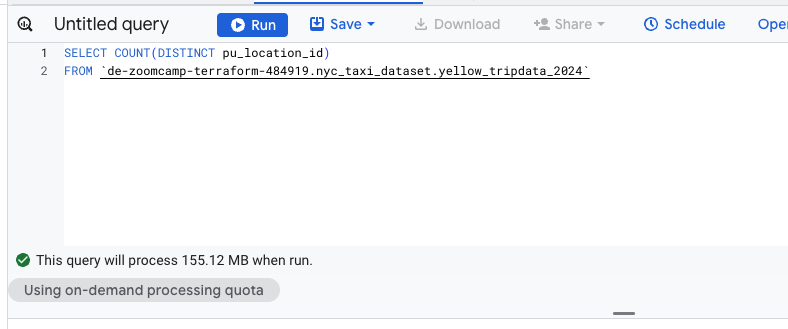
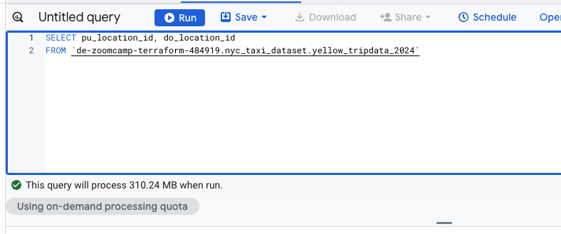
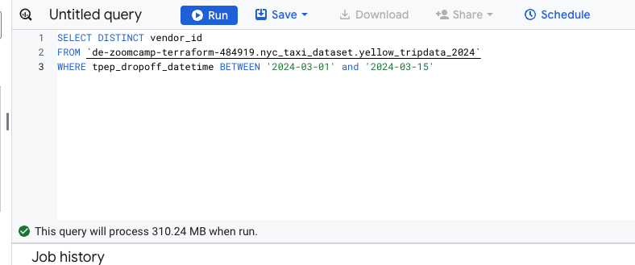
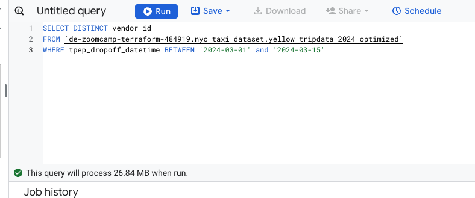
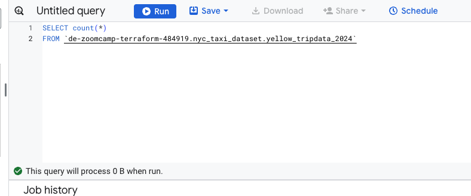

# Homework

#### What is count of records for the 2024 Yellow Taxi Data?

#### What is the estimated amount of data that will be read when this query is executed on the External Table and the Table?

#### Why are the estimated number of Bytes different?
BigQuery is a columnar database, and it only scans the specific columns requested in the query. Querying two columns (PULocationID, DOLocationID) requires reading more data than querying one column (PULocationID), leading to a higher estimated number of bytes processed.

#### How many records have a fare_amount of 0?

#### Write a query to retrieve the distinct VendorIDs between tpep_dropoff_datetime 2024-03-01 and 2024-03-15 (inclusive). Use the materialized table you created earlier in your from clause and note the estimated bytes. Now change the table in the from clause to the partitioned table you created for question 5 and note the estimated bytes processed. What are these values??

#### Write a `SELECT count(*)` query FROM the materialized table you created. How many bytes does it estimate will be read? Why?
Materialized views store precomputed results. BigQuery does not need to scan the underlying data to compute COUNT(*) because it already knows the total number of rows from the precomputation.
